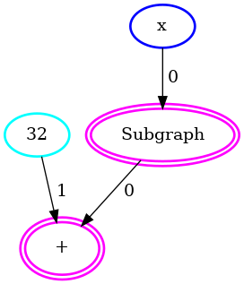

# Fusing Floating Point Operations

## Why is it needed?

The current compiler stack only supports integers with 7 bits or less. But it's not uncommon to have numpy code using floating point numbers.

We added fusing floating point operations to make tracing numpy functions somewhat user friendly to allow in-line quantization in the numpy code e.g.:

```python
import numpy

def quantized_sin(x):
    # from a 7 bit unsigned integer x, compute z in the [0; 2 * pi] range
    z = 2 * numpy.pi * x * (1 / 127)
    # quantize over 6 bits and offset to be >= 0, round and convert to integers in range [0; 63]
    quantized_sin = numpy.rint(31 * numpy.sin(z) + 31).astype(numpy.int32)
    # output quantized_sin and a further offset result
    return quantized_sin, quantized_sin + 32
```

This function `quantized_sin` is not strictly supported as is by the compiler as there are floating point intermediate values. However, when looking at the function globally we can see we have a single integer input and a single integer output. As we know the input range we can compute a table to represent the whole computation for each input value, which can later be lowered to a PBS in the FHE world.

Any computation where there is a single variable integer input and a single integer output can be replaced by an equivalent table look-up.

The `quantized_sin` graph of operations:


The float subgraph that was detected:


The simplified graph of operations with the float subgraph condensed in an `ArbitraryFunction` node:



## How is it done in concretefhe?

The first step consists in detecting where we go from floating point computation back to integers. This allows to identify the potential terminal node of the float subgraph we are going to fuse.

From the terminal node, we go back up through the nodes until we find nodes that go from integers to floats. If we can guarantee the identified float subgraph has a single variable integer input then we can replace it by an equivalent ArbitraryFunction node.

An example of a non fusable computation with that technique is:

```python
import numpy

def non_fusable(x, y):
    x_1 = x + 1.5 # x_1 is now float
    y_1 = y + 3.4 # y_1 is now float
    add = x_1 + y_1
    add_int = add.astype(numpy.int32)
    return add_int
```

From `add_int` you will find two `Add` nodes going from int to float (`x_1` and `y_1`) which we cannot represent with a single input table look-up.

## Possible improvements

This technique is not perfect because you could try to go further back in the graph to find a single variable input.

Firstly, it does not cover optimizing the graph, so you can end up with multiple operations, like additions with constants, or two look-up tables in a row, that can trivially be fused but that are not fused, as the optimization work is left to the compiler backend with MLIR and LLVM tooling. This first limitation does not impact the kind of programs that are compilable.

Secondly, the current approach fails to handle some programs that in practice could be compiled. The following example could be covered by pushing the search to find a single integer input:

```python
def theoretically_fusable(x):
    x_1 = x + 1.5
    x_2 = x + 3.4
    add = x_1 + x_2
    add_int = add.astype(numpy.int32)
    return add_int
```

Here the whole function is a single int giving a single int (i.e. representable by a table look-up), but the current implementation of fusing is going to find `x_1` and `x_2` as the starting nodes of the float subgraph and say it cannot fuse it. Room for improvement. It is probably a graph coloring problem where we would have to list for all graph's inputs which nodes depend on them.

At some point having a proper optimization system with patterns and rules to rewrite them could become more interesting than having this ad-hoc system.
