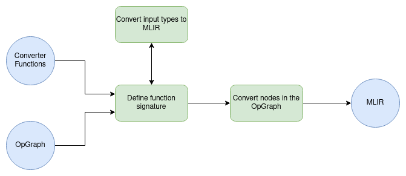

# MLIR

MLIR is the intermediate representation used by the **Concrete** compiler, so we need to convert the operation graph to MLIR, which will look something like the following, for a graph performing the dot between two input tensors.

```
func @main(%arg0: tensor<4xi7>, %arg1: tensor<4x!HLFHE.eint<6>>) -> !HLFHE.eint<6> {
    %0 = "HLFHE.dot_eint_int"(%arg1, %arg0) : (tensor<4x!HLFHE.eint<6>>, tensor<4xi7>) -> !HLFHE.eint<6>
    return %0 : !HLFHE.eint<6>
}
```

The different steps of the transformation are depicted in the figure below. We will explain each part separately later on.



The conversion uses as input the operation graph to convert, as well as a dictionary of node converter functions.

## Define function signature

The first step would be to define the function signature (excluding return value at this point). We will convert input node's types to MLIR (e.g. convert `EncryptedTensor(Integer(64, is_signed=False), shape=(4,))` to `tensor<4xi64>`) and map their values to the argument of the function. So if we had an operation graph with one `EncryptedScalar(Integer(7, is_signed=False))`, we will get an MLIR function like `func @main(%arg0 : !HLFHE.eint<7>) -> (<ret-type>)`. Note that the return type would be detected automatically later on when returning MLIR values.

## Convert nodes in the OpGraph

After that, we will iterate over the operation graph, node by node, and fetch the appropriate conversion function for that node to do the conversion. Converters should be stored in a dictionary mapping a node to the converter function. All functions need to have the same signature `converter(node: IntermediateNode, preds: List[IntermediateNode], ir_to_mlir_node: dict, context: mlir.Context)`.
- The `node` will be just the node to convert, it will be used to get information about inputs and outputs. Each specific conversion might require a different set of information, so each function fetches those separately.
- `preds` would be the operands of the operation, as they are the input for the converted `node`.
- The `ir_to_mlir_node` is a mutable dict that we update as we traverse the graph. It maps nodes to their respective values in MLIR. We need this during the creation of an MLIR operation out of a node, the node's inputs will be operands for the operation, but we can't use them as is, we need their MLIR value. The first nodes to be added are the input nodes, which should map to the arguments of the MLIR function. Everytime we convert a node to its MLIR equivalent, we add the mapping between the node and the MLIR value, so that whenever this node will be used as input to another one, we can retrieve its MLIR value. This will also be useful to know which MLIR value(s) to return at the end, as we already can identify output node(s), it will be easy to retrieve their MLIR values using this data structure.
- The `context` should be loaded with the required dialects to be able to create MLIR operations and types for the compiler.

