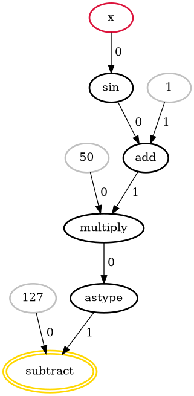

# Compilation Artifacts

In this tutorial, we are going to go over the artifact system, which is designed to inspect/debug the compilation process easily. 

## Automatic export

In case of compilation failures, artifacts are exported automatically to `.artifacts` directory under the working directory. Let's intentionally create a compilation failure and show what kinds of things are exported.

<!--python-test:skip-->
```python
def f(x):
    return np.sin(x)
```

This function fails (for now) to compile because `Concrete` doesn't support floating point outputs. When you try to compile it (you might want to check [this](../howto/COMPILING_AND_EXECUTING.md) to see how you can do that), an exception will be raised and the artifacts will be exported automatically.

### environment.txt

This file contains information about your setup (i.e., your operating system and python version).

```
Linux-5.12.13-arch1-2-x86_64-with-glibc2.29 #1 SMP PREEMPT Fri, 25 Jun 2021 22:56:51 +0000
Python 3.8.10
```

### requirements.txt

This file contains information about python packages and their versions installed on your system.

```
alabaster==0.7.12
appdirs==1.4.4
argon2-cffi==21.1.0
...
wheel==0.37.0
widgetsnbextension==3.5.1
wrapt==1.12.1
```

### function.txt

This file contains information about the function you are trying to compile.

```
def f(x):
    return np.sin(x)
```

### parameters.txt

This file contains information about the parameters of the function you are trying to compile.

```
x :: EncryptedScalar<Integer<unsigned, 3 bits>>
```

### 1.initial.graph.txt

This file contains information about the initial computation graph of the function you are trying to compile.

```
%0 = x                                   # EncryptedScalar<Integer<unsigned, 3 bits>>
%1 = np.sin(0)                           # EncryptedScalar<Float<64 bits>>
return(%1)
```

### 1.initial.graph.png

This file contains the visualization of the initial computation graph of the function you are trying to compile.


### traceback.txt

This file contains information about the error you got.

```
Traceback (most recent call last):
  File "/src/concrete/numpy/compile.py", line 301, in compile_numpy_function
    return _compile_numpy_function_internal(
  File "/src/concrete/numpy/compile.py", line 234, in _compile_numpy_function_internal
    op_graph = _compile_numpy_function_into_op_graph_internal(
  File "/src/concrete/numpy/compile.py", line 103, in _compile_numpy_function_into_op_graph_internal
    raise ValueError(
ValueError: <lambda> cannot be compiled as it has nodes with either float inputs or outputs.
Offending nodes : <concrete.common.representation.intermediate.UnivariateFunction object at 0x7f6689fd37f0>
```

## Manual export

Manual exports are mostly used for visualization. Nonetheless, they can be very useful for demonstrations. Here is how to do it:

```python
import concrete.numpy as hnp
import pathlib

artifacts = hnp.CompilationArtifacts(pathlib.Path("/tmp/custom/export/path"))
hnp.compile_numpy_function(
    lambda x: 100 - (3 * (x + 2)),
    {"x": hnp.EncryptedScalar(hnp.UnsignedInteger(3))},
    inputset=[(i,) for i in range(2 ** 3)],
    compilation_artifacts=artifacts,
)
artifacts.export()
```

Since this example compiles, we can see some new artifacts. 

### 1.initial.graph.txt

This file contains information about the initial computation graph of the function you are trying to compile.

```
%0 = Constant(100)                       # ClearScalar<Integer<unsigned, 7 bits>>
%1 = Constant(3)                         # ClearScalar<Integer<unsigned, 2 bits>>
%2 = x                                   # EncryptedScalar<Integer<unsigned, 3 bits>>
%3 = Constant(2)                         # ClearScalar<Integer<unsigned, 2 bits>>
%4 = Add(2, 3)                           # EncryptedScalar<Integer<unsigned, 3 bits>>
%5 = Mul(4, 1)                           # EncryptedScalar<Integer<unsigned, 3 bits>>
%6 = Sub(0, 5)                           # EncryptedScalar<Integer<unsigned, 7 bits>>
return(%6)
```

### 1.initial.graph.png

This file contains the visualization of the initial computation graph of the function you are trying to compile.



### 2.final.graph.txt

This file contains information about the final computation graph of the function you are trying to compile.

```
%0 = Constant(100)                       # ClearScalar<Integer<unsigned, 7 bits>>
%1 = Constant(3)                         # ClearScalar<Integer<unsigned, 2 bits>>
%2 = x                                   # EncryptedScalar<Integer<unsigned, 3 bits>>
%3 = Constant(2)                         # ClearScalar<Integer<unsigned, 2 bits>>
%4 = Add(2, 3)                           # EncryptedScalar<Integer<unsigned, 4 bits>>
%5 = Mul(4, 1)                           # EncryptedScalar<Integer<unsigned, 5 bits>>
%6 = Sub(0, 5)                           # EncryptedScalar<Integer<unsigned, 7 bits>>
return(%6)
```

### 2.final.graph.png

This file contains the visualization of the final computation graph of the function you are trying to compile.


### bounds.txt

This file contains information about the bounds of the final computation graph of the function you are trying to compile using the input set you provide.

```
%0 :: [100, 100]
%1 :: [3, 3]
%2 :: [0, 7]
%3 :: [2, 2]
%4 :: [2, 9]
%5 :: [6, 27]
%6 :: [73, 94]
```

You can learn what bounds are [here](../../dev/explanation/TERMINOLOGY_AND_STRUCTURE.md).

### mlir.txt

This file contains information about the MLIR of the function you are trying to compile using the input set you provide.

```
module  {
  func @main(%arg0: !HLFHE.eint<7>) -> !HLFHE.eint<7> {
    %c100_i8 = constant 100 : i8
    %c3_i8 = constant 3 : i8
    %c2_i8 = constant 2 : i8
    %0 = "HLFHE.add_eint_int"(%arg0, %c2_i8) : (!HLFHE.eint<7>, i8) -> !HLFHE.eint<7>
    %1 = "HLFHE.mul_eint_int"(%0, %c3_i8) : (!HLFHE.eint<7>, i8) -> !HLFHE.eint<7>
    %2 = "HLFHE.sub_int_eint"(%c100_i8, %1) : (i8, !HLFHE.eint<7>) -> !HLFHE.eint<7>
    return %2 : !HLFHE.eint<7>
  }
}
```

You can learn more about MLIR [here](../../dev/explanation/MLIR.md).
