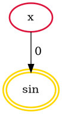
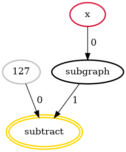

# Compilation Artifacts

In this tutorial, we are going to go over the artifact system, which is designed to inspect/debug the compilation process easily. 

## Automatic export

In case of compilation failures, artifacts are exported automatically to `.artifacts` directory under the working directory. Let's intentionally create a compilation failure and show what kinds of things are exported.

<!--python-test:skip-->
```python
def f(x):
    return np.sin(x)
```

This function fails to compile because **Concrete Framework** doesn't support floating point outputs. When you try to compile it (you might want to check [this](../howto/COMPILING_AND_EXECUTING.md) to see how you can do that), an exception will be raised and the artifacts will be exported automatically.

### environment.txt

This file contains information about your setup (i.e., your operating system and python version).

```
Linux-5.12.13-arch1-2-x86_64-with-glibc2.29 #1 SMP PREEMPT Fri, 25 Jun 2021 22:56:51 +0000
Python 3.8.10
```

### requirements.txt

This file contains information about python packages and their versions installed on your system.

```
alabaster==0.7.12
appdirs==1.4.4
argon2-cffi==21.1.0
...
wheel==0.37.0
widgetsnbextension==3.5.1
wrapt==1.12.1
```

### function.txt

This file contains information about the function you are trying to compile.

```
def f(x):
    return np.sin(x)
```

### parameters.txt

This file contains information about the parameters of the function you are trying to compile.

```
x :: EncryptedScalar<Integer<unsigned, 3 bits>>
```

### 1.initial.graph.txt

This file contains textual representation of the initial computation graph right after tracing.

```
%0 = x              # EncryptedScalar<uint3>
%1 = sin(%0)        # EncryptedScalar<float64>
return %1
```

### 1.initial.graph.png

This file contains the visual representation of the initial computation graph right after tracing.


### 2.final.graph.txt

This file contains textual representation of the final computation graph right before MLIR conversion.

```
%0 = x              # EncryptedScalar<uint3>
%1 = sin(%0)        # EncryptedScalar<float64>
return %1
```

### 2.final.graph.png

This file contains the visual representation of the final computation graph right before MLIR conversion.



### traceback.txt

This file contains information about the error you got.

```
Traceback (most recent call last):
  File "/home/default/Documents/Projects/Zama/hdk/concrete/numpy/compile.py", line 141, in run_compilation_function_with_error_management
    return compilation_function()
  File "/home/default/Documents/Projects/Zama/hdk/concrete/numpy/compile.py", line 769, in compilation_function
    return _compile_numpy_function_internal(
  File "/home/default/Documents/Projects/Zama/hdk/concrete/numpy/compile.py", line 722, in _compile_numpy_function_internal
    fhe_circuit = _compile_op_graph_to_fhe_circuit_internal(
  File "/home/default/Documents/Projects/Zama/hdk/concrete/numpy/compile.py", line 626, in _compile_op_graph_to_fhe_circuit_internal
    prepare_op_graph_for_mlir(op_graph)
  File "/home/default/Documents/Projects/Zama/hdk/concrete/numpy/compile.py", line 597, in prepare_op_graph_for_mlir
    raise RuntimeError(
RuntimeError: function you are trying to compile isn't supported for MLIR lowering

%0 = x              # EncryptedScalar<uint3>
%1 = sin(%0)        # EncryptedScalar<float64>
^^^^^^^^^^^^^^^^^^^^^^^^^^^^^^^^^^^^^^^^^^^^^^ only integer outputs are supported
return %1
```

## Manual export

Manual exports are mostly used for visualization. Nonetheless, they can be very useful for demonstrations. Here is how to do it:

```python
import concrete.numpy as hnp
import numpy as np
import pathlib

def f(x):
    return 127 - (50 * (np.sin(x) + 1)).astype(np.uint32)

artifacts = hnp.CompilationArtifacts(pathlib.Path("/tmp/custom/export/path"))

compiler = hnp.NPFHECompiler(f, {"x": "encrypted"}, compilation_artifacts=artifacts)
compiler.eval_on_inputset(range(2 ** 3))

artifacts.export()
```

### 1.initial.graph.txt

This file contains textual representation of the initial computation graph right after tracing.

```
%0 = 127                             # ClearScalar<uint7>
%1 = 50                              # ClearScalar<uint6>
%2 = 1                               # ClearScalar<uint1>
%3 = x                               # EncryptedScalar<uint3>
%4 = sin(%3)                         # EncryptedScalar<float64>
%5 = add(%4, %2)                     # EncryptedScalar<float64>
%6 = mul(%5, %1)                     # EncryptedScalar<float64>
%7 = astype(%6, dtype=uint32)        # EncryptedScalar<uint32>
%8 = sub(%0, %7)                     # EncryptedScalar<uint32>
return %8
```

### 1.initial.graph.png

This file contains the visual representation of the initial computation graph right after tracing.


### 2.after-float-fuse-0.graph.txt

This file contains textual representation of the intermediate computation graph after fusing.

```
%0 = 127                 # ClearScalar<uint7>
%1 = x                   # EncryptedScalar<uint3>
%2 = subgraph(%1)        # EncryptedScalar<uint32>
%3 = sub(%0, %2)         # EncryptedScalar<uint32>
return %3

Subgraphs:

    %2 = subgraph(%1):

        %0 = 50                              # ClearScalar<uint6>
        %1 = 1                               # ClearScalar<uint1>
        %2 = float_subgraph_input            # EncryptedScalar<uint3>
        %3 = sin(%2)                         # EncryptedScalar<float64>
        %4 = add(%3, %1)                     # EncryptedScalar<float64>
        %5 = mul(%4, %0)                     # EncryptedScalar<float64>
        %6 = astype(%5, dtype=uint32)        # EncryptedScalar<uint32>
        return %6
```

### 2.after-float-fuse-0.graph.png

This file contains the visual representation of the intermediate computation graph after fusing.


### 3.final.graph.txt

This file contains textual representation of the final computation graph right before MLIR conversion.

```
%0 = 127                 # ClearScalar<uint7>
%1 = x                   # EncryptedScalar<uint3>
%2 = subgraph(%1)        # EncryptedScalar<uint7>
%3 = sub(%0, %2)         # EncryptedScalar<uint7>
return %3

Subgraphs:

    %2 = subgraph(%1):

        %0 = 50                              # ClearScalar<uint6>
        %1 = 1                               # ClearScalar<uint1>
        %2 = float_subgraph_input            # EncryptedScalar<uint3>
        %3 = sin(%2)                         # EncryptedScalar<float64>
        %4 = add(%3, %1)                     # EncryptedScalar<float64>
        %5 = mul(%4, %0)                     # EncryptedScalar<float64>
        %6 = astype(%5, dtype=uint32)        # EncryptedScalar<uint7>
        return %6
```

### 3.final.graph.png

This file contains the visual representation of the final computation graph right before MLIR conversion.



### bounds.txt

This file contains information about the bounds of the final computation graph of the function you are trying to compile using the input set you provide.

```
%0 :: [127, 127]
%1 :: [0, 7]
%2 :: [2, 95]
%3 :: [32, 125]
```

You can learn what bounds are [here](../../dev/explanation/TERMINOLOGY_AND_STRUCTURE.md).

### mlir.txt

This file contains information about the MLIR of the function you are trying to compile using the input set you provide.

```
module  {
  func @main(%arg0: !HLFHE.eint<7>) -> !HLFHE.eint<7> {
    %c127_i8 = arith.constant 127 : i8
    %cst = arith.constant dense<"..."> : tensor<128xi64>
    %0 = "HLFHE.apply_lookup_table"(%arg0, %cst) : (!HLFHE.eint<7>, tensor<128xi64>) -> !HLFHE.eint<7>
    %1 = "HLFHE.sub_int_eint"(%c127_i8, %0) : (i8, !HLFHE.eint<7>) -> !HLFHE.eint<7>
    return %1 : !HLFHE.eint<7>
  }
}

```

You can learn more about MLIR [here](../../dev/explanation/MLIR.md).
