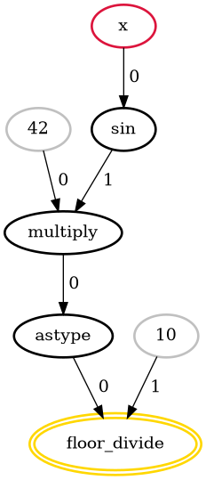

# Table Lookup

In this tutorial, we are going to go over the ways to perform table lookups in **concrete**. Please read [Compiling and Executing](../howto/COMPILING_AND_EXECUTING.md) before reading further to see how you can compile the functions below.

## Direct table lookup

**concrete** provides a special class to allow direct table lookups. Here is how to import and use it:

```python
from concrete.common.extensions.table import LookupTable

table = LookupTable([2, 1, 3, 0])

def f(x):
    return table[x]
```

where

- `x = EncryptedScalar(UnsignedInteger(2))`

results in

<!--python-test:skip-->
```python
engine.run(0) == 2
engine.run(1) == 1
engine.run(2) == 3
engine.run(3) == 0
```

## Fused table lookup

Direct tables are tedious to prepare by hand. When possible, **concrete** fuses the floating point operations into a single table lookup automatically. There are some limitations on fusing operations, which you can learn more about on the next tutorial, [Working With Floating Points](./WORKING_WITH_FLOATING_POINTS.md).

Here is an example function that results in fused table lookup:

<!--python-test:skip-->
```python
def f(x):
    return 127 - (50 * (np.sin(x) + 1)).astype(np.uint32) # astype is to go back to integer world
```

where

- `x = EncryptedScalar(UnsignedInteger(3))`

results in

<!--python-test:skip-->
```python
engine.run(0) == 77
engine.run(1) == 35
engine.run(2) == 32
engine.run(3) == 70
engine.run(4) == 115
engine.run(5) == 125
engine.run(6) == 91
engine.run(7) == 45
```

Initially, the function is converted to this operation graph



and after floating point operations are fused, we get the following operation graph


Internally, it uses the following lookup table

<!--python-test:skip-->
```python
table = LookupTable([50, 92, 95, 57, 12, 2, 36, 82])
```

which is calculated by:

<!--python-test:skip-->
```python
[(50 * (np.sin(x) + 1)).astype(np.uint32) for x in range(2 ** 3)]
```
