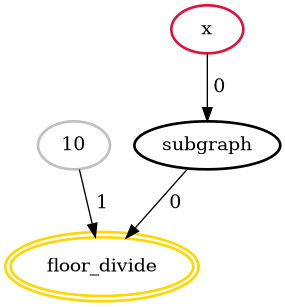

# Table Lookup

In this tutorial, we are going to go over the ways to perform direct table lookups in **Concrete Numpy**. Please read [Compiling and Executing](../basics/compiling_and_executing.md) before reading further to see how you can compile the functions below.

## Direct table lookup

**Concrete Numpy** provides a special class to allow direct table lookups. Here is how to use it:

```python
import concrete.numpy as hnp

table = hnp.LookupTable([2, 1, 3, 0])

def f(x):
    return table[x]
```

where

- `x = "encrypted"` scalar

results in

<!--pytest-codeblocks:skip-->
```python
circuit.run(0) == 2
circuit.run(1) == 1
circuit.run(2) == 3
circuit.run(3) == 0
```

Moreover, direct lookup tables can be used with tensors where the same table lookup is applied to each value in the tensor, so

- `x = "encrypted"` tensor of shape `(2, 3)`

results in

<!--pytest-codeblocks:skip-->
```python
input = np.array([[0, 1, 3], [2, 3, 1]], dtype=np.uint8)
circuit.run(input) == [[2, 1, 0], [3, 0, 1]]
```

## Direct Multi Table Lookup

Sometimes you may want to apply a different lookup table to each value in a tensor. That's where direct multi lookup table becomes handy. Here is how to use it:

<!--pytest-codeblocks:skip-->
```python
import concrete.numpy as hnp

squared = hnp.LookupTable([i ** 2 for i in range(4)])
cubed = hnp.LookupTable([i ** 3 for i in range(4)])

table = hnp.MultiLookupTable([
    [squared, cubed],
    [squared, cubed],
    [squared, cubed],
])

def f(x):
    return table[x]
```

where

- `x = "encrypted"` tensor of shape `(3, 2)`

results in

<!--pytest-codeblocks:skip-->
```python
input = np.array([[2, 3], [1, 2], [3, 0]], dtype=np.uint8)
circuit.run(input) == [[4, 27], [1, 8], [9, 0]]
```

Basically, we applied `squared` table to the first column and `cubed` to the second one.

## Fused table lookup

Direct tables are tedious to prepare by hand. When possible, **Concrete Numpy** fuses the floating point operations into table lookups automatically. There are some limitations on fusing operations, which you can learn more about on the next tutorial, [Working With Floating Points](./working_with_floating_points.md).

Here is an example function that results in fused table lookup:

<!--pytest-codeblocks:skip-->
```python
def f(x):
    return 127 - (50 * (np.sin(x) + 1)).astype(np.uint32) # astype is to go back to integer world
```

where

- `x = "encrypted"` scalar

results in

<!--pytest-codeblocks:skip-->
```python
circuit.run(0) == 77
circuit.run(1) == 35
circuit.run(2) == 32
circuit.run(3) == 70
circuit.run(4) == 115
circuit.run(5) == 125
circuit.run(6) == 91
circuit.run(7) == 45
```

Initially, the function is converted to this operation graph


and after floating point operations are fused, we get the following operation graph



Internally, it uses the following lookup table

<!--pytest-codeblocks:skip-->
```python
table = hnp.LookupTable([50, 92, 95, 57, 12, 2, 36, 82])
```

which is calculated by:

<!--pytest-codeblocks:skip-->
```python
[(50 * (np.sin(x) + 1)).astype(np.uint32) for x in range(2 ** 3)]
```
